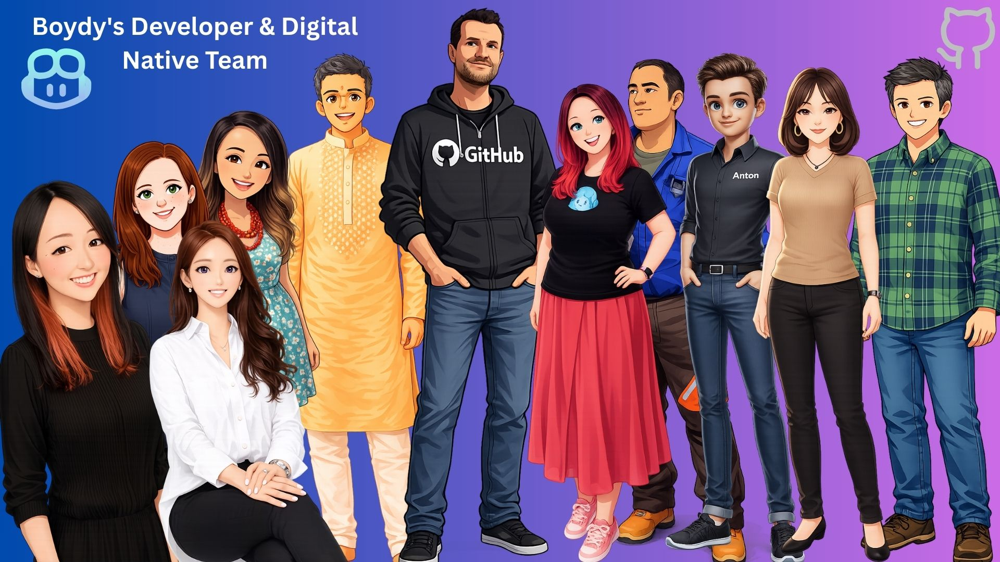

{ .hero-image }

# Get in Touch

I'd love to hear from you! Whether you have questions, feedback, or just want to connect, feel free to reach out.

## Connect With Me

### 💼 **Professional**

- **GitHub**: [@codess-aus](https://github.com/codess-aus)
- **LinkedIn**: Connect with me on [LinkedIn](https://www.linkedin.com/in/michellesandford)

### 🐦 **Social**

- **Twitter**: Follow me [@smashing_avocado](https://twitter.com)
- **Dev.to**: Read my articles on [Dev.to](https://dev.to)

### 📧 **Email**

For inquiries or collaborations:
- **Email**: hello@smashingavocado.dev

## What Can We Talk About?

I'm always interested in discussing:

- **Technology & Development**: Web development, Python, JavaScript, cloud computing
- **Open Source**: Collaboration opportunities and project ideas
- **Speaking Engagements**: Talks, workshops, and conference sessions
- **Consulting**: Technical consulting for your projects
- **Mentorship**: Career advice and guidance for aspiring developers

## Feedback Welcome

Your feedback helps me improve! If you have suggestions for:

- Blog post topics you'd like to see
- Technical content requests
- Website improvements
- General thoughts and ideas

Please don't hesitate to reach out. I read and respond to every message.

## Response Time

I typically respond within 2-3 business days. If you haven't heard back from me, feel free to send a friendly reminder!

---

## Stay Updated

Want to stay in the loop? Here's how:

- **Subscribe**: Add this blog to your RSS reader (coming soon!)
- **Follow**: Connect on social media for updates
- **Star**: Give the [GitHub repository](https://github.com/codess-aus/smashing-avocado) a star

---

*Looking forward to connecting with you!* 🥑
