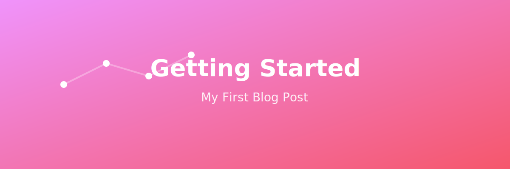

{ .hero-image }

# First Post: Getting Started

*Published: January 29, 2026*

Welcome to my very first blog post! I'm thrilled to embark on this journey of sharing my thoughts, experiences, and learnings with the world.

## Why Start a Blog?

Starting a blog has been on my mind for quite some time. Here are a few reasons why I decided to take the plunge:

### 1. **Document My Learning Journey**

As a developer, I'm constantly learning new technologies, frameworks, and best practices. Writing about what I learn helps solidify my understanding and creates a valuable reference for the future.

### 2. **Share Knowledge with Others**

The tech community has given me so much knowledge and support over the years. It's time to give back by sharing my own experiences and insights that might help others on their journey.

### 3. **Connect with Like-Minded People**

Blogging opens doors to connect with people who share similar interests. I'm excited about the conversations and relationships that will develop through this platform.

## What to Expect

In future posts, you can expect:

- **Technical tutorials** and how-to guides
- **Project showcases** and case studies
- **Thoughts on industry trends** and emerging technologies
- **Personal reflections** on the developer experience

## The Tech Behind This Blog

I built this blog using:

- **MkDocs**: A fast, simple static site generator perfect for project documentation and blogs
- **Material for MkDocs**: A beautiful, responsive theme with modern design principles
- **GitHub Pages**: Free hosting that integrates seamlessly with version control

## Let's Connect

This is just the beginning, more coming! I'd love to hear your feedback, suggestions, or just connect. Feel free to reach out through the [contact page](contact.md).

---

*Stay tuned for more posts coming soon!*
