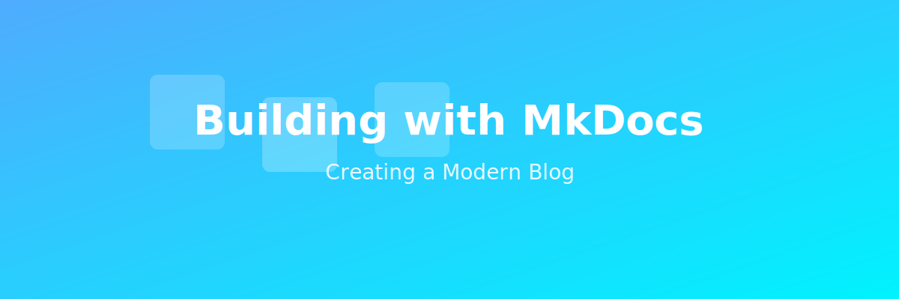

<div class="hero-section" markdown="1">
{ .hero-image }
</div>

# Second Post: Building with MkDocs

*Published: January 29, 2026*

In this post, I want to share the technical journey of building this blog. If you're considering starting your own blog or documentation site, this might give you some helpful insights!

## Why MkDocs?

When choosing a platform for my blog, I had several requirements:

- **Fast and Simple**: I wanted something that generates static sites quickly
- **Markdown-Based**: Writing in Markdown is clean and efficient
- **Beautiful Design**: The site needed to look modern and professional
- **Responsive**: Must work perfectly on all devices
- **Accessible**: Following web accessibility standards is crucial

MkDocs with the Material theme checked all these boxes!

## Key Features Implemented

### 🎨 **Modern Gradient Design**

I implemented a custom gradient color scheme using deep purple and pink accents. The theme supports both light and dark modes, automatically adapting to user preferences.

### 📱 **Fully Responsive**

The site is built with mobile-first principles. Whether you're on a phone, tablet, or desktop, you'll have a great experience.

### ♿ **Accessibility First**

Following WCAG guidelines, the site includes:

- Proper semantic HTML
- Keyboard navigation support
- Screen reader optimization
- Sufficient color contrast
- Alternative text for images

### 🖼️ **Hero Images**

Each page features a beautiful hero image at the top, creating visual interest and setting the tone for the content.

### 🔍 **Built-in Search**

The Material theme provides instant search functionality, making it easy to find content across the entire site.

## Technical Setup

Here's a quick overview of the setup:

```yaml
theme:
  name: material
  palette:
    - scheme: default
      primary: deep purple
      accent: pink
  font:
    text: Inter
    code: JetBrains Mono
  features:
    - navigation.instant
    - navigation.tracking
    - search.suggest
```

## Deployment

The blog is deployed to GitHub Pages using GitHub Actions. Every time I push changes to the repository, the site automatically rebuilds and deploys. It's a seamless workflow that lets me focus on writing content.

## Lessons Learned

1. **Start Simple**: Don't over-engineer from the beginning
2. **Focus on Content**: The best design supports great content
3. **Iterate Quickly**: Make small improvements continuously
4. **User Experience Matters**: Always test on different devices

## What's Next?

I'm planning to add:

- Blog post tags and categories
- RSS feed for subscribers
- Comment system for reader engagement
- More interactive examples

---

*Have questions about building with MkDocs? [Reach out](contact.md) - I'd love to help!*
